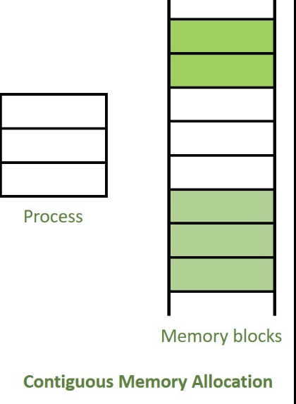
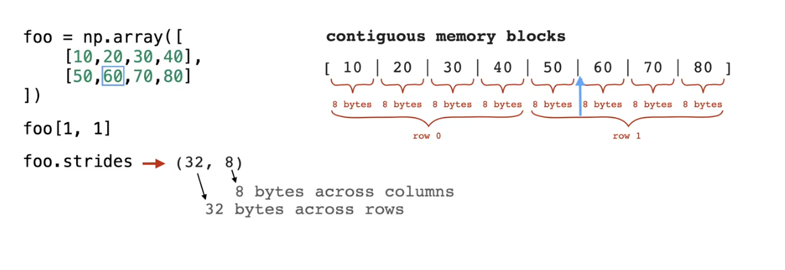

# Kernels from Scratch

Implements & explains a kernel, **assuming you know absolutely nothing.** 

Enjoy!
1. [What is a Kernel?](#1-kernel)
2. [Fundamentals & Memory Management](#1-fundamentals--memory-management)


### 1. Kernel
The kernel is the core part of your operating system (OS) that sits between your computer's hardware and all other software (like apps or the user interface).

- It abstracts hardware differences, giving software a consistent, standardized environment to run on.

This means developers don’t need to write different code for each type of hardware.

Analogy:
Think of the kernel like your house’s plumbing system.
It doesn’t matter where the water comes out—your shower, kitchen sink, or garden hose—the plumbing makes sure it flows properly, no matter the source.
Similarly, the kernel ensures that software can access and use hardware resources smoothly and reliably.


## 2. Fundamentals & Memory Management

### Pointers and references (C++):

#### **Reference**: 
an alias for an existing object. Is essentially identical to the object being referenced.

   - It does **not** store its own value or memory address. It directly refers to another variable's address in memory.

   Think of it like a nickname for the same person—you’re referring to the same underlying thing.

**Any change made through the reference affects the original variable and vice versa.**


```
// regular types
int             // a normal int type (not a reference)
int&            // a reference to an int object
double&         // a reference to a double object
const int&      // a reference to a const int object
```
<br>

The syntax for references `type& ref` is not to be confused with the address-of operator `&x`, which returns the memory address of variable x.

For example,

```
#include <iostream>

int main()
{
    int x{ 5 };
    std::cout << x << '\n';  // print the value of variable x
    std::cout << &x << '\n'; // print the memory address of variable x

    return 0;
}
```
One run of this prints:
```
5
0027FEA0
```

#### Tip:
The & symbol tends to cause confusion because it has different meanings depending on context:

- When following a type name, & denotes an lvalue reference: `int& ref`.
- When used in a unary context in an expression, & is the address-of operator: `std::cout << &x`.
- When used in a binary context in an expression, & is the Bitwise AND operator: `std::cout << x & y`.


<br>

[See code here](./Fundamentals/C++/reference.cpp)


---

#### Dereference operator (*)

Returns the value at a given memory address.

For example,

```
int main(){
   int x = 5;
   std::cout << x;      // print the value
   std::cout << &x;     // print the memory address

   std::cout << *(&x);     // // print the value at the memory address

   return 0;
}
```

* and & essentially cancel each other out.


---

#### **Pointer** (type*): 
**object that holds a *memory address* of a variable.**

```
int;     // a normal int
int&;    // a reference to an int value
int*;    // a pointer to an int value
```

It is best practice to always initialize your pointers. 

Once we have a pointer holding the address of another object, we can use the dereference operator (*) to access the value at that address. 

For example,

```
int x = 5;
int* ptr = &x;
std::cout << *ptr << "\n";    // prints 5
```


[See code here](./Fundamentals/C++/pointer.cpp)


**Key insight**:

When we use a pointer without a dereference (`ptr`), we are accessing the address held by the pointer. Modifying this (`ptr = &y`) changes what the pointer is pointing at.

When we dereference a pointer (`*ptr`), we are accessing the object being pointed at. Modifying this (`*ptr = 6;`) changes the value of the object being pointed at.

## 2. Tensors

In tensor kernel development, you'll often use pointer arithmetic to:

- Navigate through memory: Moving through tensor data efficiently
- Implement strided access: Efficiently accessing non-contiguous elements
- Handle different memory layouts: Working with row-major vs column-major data

Memory layout for tensors refers to how tensor data is physically arranged in computer memory. Although tensors are multi-dimensional arrays, computer memory is linear (one-dimensional).

The memory layout is the mapping that determines how the multi-dimensional tensor indices translate to positions in linear memory.

##### Contiguous Memory
A tensor is stored contiguously when **all its elements are stored in a single, uninterrupted block of memory without gaps**.



*shows a process requiring 3 memory blocks, being placed into a single continuous section of free memory in RAM.*

##### Strides

Take this piece of code:

```
# strides
x = np.array([[1,2,3], 
              [4,5,6]], 
              dtype=np.int32)

print(x.strides)        # bytes to step in each dimension
```

The output is (12, 4).

Each element’s size in memory = number of bytes needed to store its value. <br>
`dtype=np.int32` means each element is a **32-bit** integer → **4 bytes** <br>
(32 bits ÷ 8 bits per byte = 4 bytes)

- First number (12) → # of bytes to move **to the next row** (axis 0)
    - each row has 3 elements x 4 bytes = 12 bytes
- Second number (4) → bytes to move **to the next column** (axis 1)
    - each step within a row moves by 1 element → 4 bytes


*another example in int64*

##### Intuition:

Think of the array as **flattened memory**:

`[1, 2, 3, 4, 5, 6]  ← all stored in a contiguous memory block`

- from `1 → 2` → +4 bytes (column move)
- from `1 → 4` → +12 bytes (row move)

[See code here](./Fundamentals/Numpy/essentials.ipynb)


## 3. Stack vs. heap allocation

##### The heap

The heap segment (also known as the *"free store"*) keeps track of memory used for dynamic allocation.

When a dynamically allocated variable is deleted, the memory is “returned” to the heap and can then be reassigned as future allocation requests are received. Remember that deleting a pointer does not delete the variable, it just returns the memory at the associated address back to the operating system.


##### The (call) stack

The call stack keeps track of all the active functions (those that have been called but have not yet terminated) from the start of the program to the current point of execution, and handles allocation of all function parameters and local variables.

Functions are **pushed** on the stack when they are **called**, and **popped** when they **return**/finish.

<br>

**Additional resources:**
- [What is the Difference Between a Pointer and a Reference C++](https://www.youtube.com/watch?v=sxHng1iufQE&ab_channel=PaulProgramming)